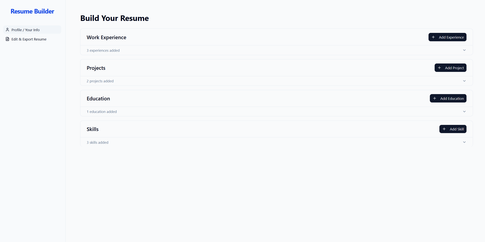
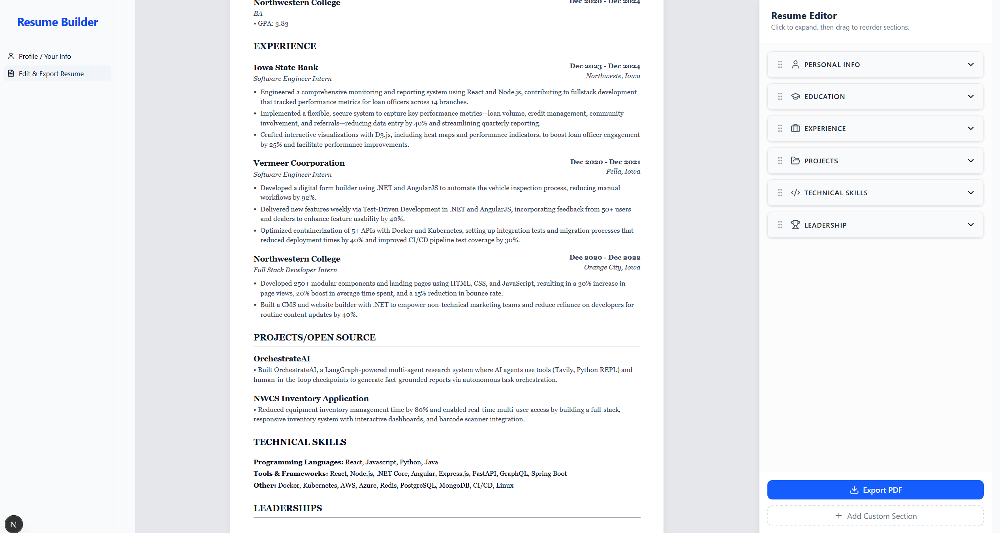

# Modular Resume Builder

A personalized, component-based resume builder to streamline job applications and generate export-ready resumes in seconds.

## 🚀 Current State

The application is a fully functional resume builder with the following features:

### ✅ Implemented Features + WIP

- **Auth0 Authentication**: Secure sign-up, login, and user session management
- **Airtable-Powered Resume Data**: Store all your resume content (projects, work experience, education, skills, etc.) in Airtable
- **Drag & Drop Interface**: Rearrange resume sections and items effortlessly
- **Live Resume Preview**: See changes instantly as you edit
- **AI Assistant**:
  - Generate or rewrite resume bullet points
  - Tailor resume to specific job descriptions
  - Summarize long content clearly
- **Modular Layout System**: Add/remove/reorder resume components like LEGO blocks
- **Responsive Design**: Works great on mobile and desktop
- **Instant Export**: Export resumes as PDF, HTML, or Markdown

## 📸 Screenshots

<div align="center">
  
  <br/>
  
</div>

## 🛠️ Tech Stack

- **Frontend**:  
  `Next.js 15`, `React 19`, `TypeScript`, `Tailwind CSS 4`, `dnd-kit`, `Radix UI`, `shadcn/ui`
- **Authentication**:  
  `Auth0`
- **Data Source**:  
  `Airtable` (your single source of truth for resume content)
- **AI Assistant**:  
  `OpenAI GPT-4` (for summaries, rewrites, bullet generation)

---

## ⚙️ Getting Started

### 1. Clone the repo & install

```bash
git clone https://github.com/PratikPaudel/modular-resume.git
cd modular-resume
npm install
```

2. Environment Variables

Create a .env.local file and include:

# Airtable
AIRTABLE_API_KEY=your_airtable_api_key
AIRTABLE_BASE_ID=your_airtable_base_id

# OpenAI
OPENAI_API_KEY=your_openai_api_key

# Auth0
AUTH0_DOMAIN=your-auth0-domain
AUTH0_CLIENT_ID=your-auth0-client-id
AUTH0_CLIENT_SECRET=your-auth0-client-secret
AUTH0_REDIRECT_URI=http://localhost:3000/api/auth/callback

## 📋 Future Todos

### 🔥 High Priority
- [ ] **PDF Export**: Add ability to export resumes as PDF
- [ ] **Multiple Templates**: Create different resume templates/styles
- [ ] **Resume Sharing**: Generate shareable links for resumes
- [ ] **Import/Export**: Allow importing from LinkedIn, JSON, PDF/Word formats, and GitHub for projects import.
- [ ] **Auto-save**: Implement real-time auto-save functionality

## 🤝 Contributing

1. Fork the repository
2. Create a feature branch (`git checkout -b feature/amazing-feature`)
3. Commit your changes (`git commit -m 'Add amazing feature'`)
4. Push to the branch (`git push origin feature/amazing-feature`)
5. Open a Pull Request

## 📄 License

This project is licensed under the MIT License - see the [LICENSE](LICENSE) file for details.

## 🙏 Acknowledgments

- Built with [Next.js](https://nextjs.org/)
- Styled with [Tailwind CSS](https://tailwindcss.com/)
- Icons from [Lucide](https://lucide.dev/)
- Database powered by [Supabase](https://supabase.com/)
- Inspired by Jobright's Resume editor. 
